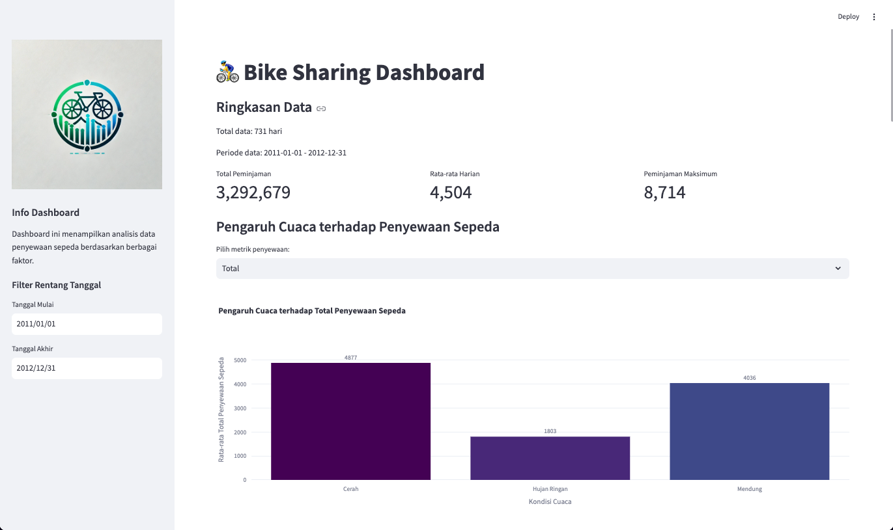

# 📊 Bike Information Dashboard

## 📌 Deskripsi

Dashboard ini dibuat menggunakan **Streamlit** untuk menganalisis data penyewaan sepeda berdasarkan berbagai faktor seperti cuaca, musim, hari dalam seminggu, dan jam dalam sehari. Dashboard ini menyediakan visualisasi interaktif untuk memudahkan pemahaman tren penyewaan sepeda dari dataset yang digunakan.

## 🛠️ Teknologi yang Digunakan

- **Python**
- **Streamlit** (untuk membangun dashboard interaktif)
- **Pandas** (untuk manipulasi data)
- **Matplotlib & Seaborn** (untuk visualisasi data)

## 📂 Struktur Folder

```
submission/
├── dashboard/
│   └── dashboard.py
│
├── data/
│   │── day.csv
│   └── hour.csv
│
├── logo.png
├── month.png
│── notebook.ipynb
│── README.md
│── requirements.txt
└── url.txt
```

## 🚀 Cara Menjalankan Dashboard

### 1️⃣ Instalasi Dependensi

Pastikan **Python** sudah terinstal di sistem. Kemudian, jalankan perintah berikut untuk menginstal pustaka yang dibutuhkan:

```sh
cd dashboard
pip install -r requirements.txt
```

### 2️⃣ Jalankan Dashboard

Gunakan perintah berikut untuk menjalankan dashboard:

```sh
streamlit run dashboard.py
```

Setelah itu, dashboard akan terbuka di browser.

## 🔍 Fitur Utama

✅ **Filter Rentang Tanggal** - Memungkinkan pengguna memilih rentang waktu tertentu untuk melihat data spesifik.
✅ **Preview Data** - Menampilkan dataset harian dan per jam dalam format tabel.
✅ **Statistik Dasar** - Menyediakan deskripsi statistik data penyewaan sepeda.
✅ **Visualisasi Data** - Menampilkan beberapa grafik analisis tren penyewaan sepeda:

- Histogram distribusi jumlah penyewaan sepeda.
- Tren penyewaan sepeda dari waktu ke waktu.
- Pengaruh musim terhadap penyewaan sepeda.
- Pola penggunaan sepeda berdasarkan jam dalam sehari.
- Tren penyewaan sepeda berdasarkan jam.
- Faktor yang Paling Berpengaruh terhadap Penyewaan Sepeda

## 📈 Contoh Visualisasi

Salah satu contoh visualisasi yang dihasilkan oleh dashboard ini:

- **Pengaruh Cuaca terhadap Penyewaan Sepeda**
  

## 👨‍💻 Kontributor

- **ANDHIKA SEPTIAN PRAYOGA**
